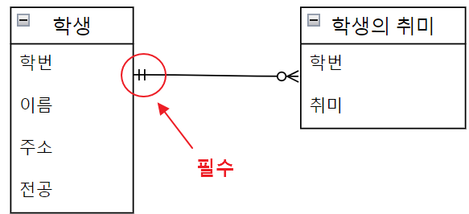

# 데이터 모델링, ERD 만들기
## 순서
- 1.데이터 모델링 이란?
  - 1.1. 데이터 모델링 순서 절차
    - 1.1.1. 업무 파악 (요구사항 수집 및 분석)
    - 1.1.2. 개념적 데이터 모델링
    - 1.1.3. 논리적 데이터 모델링
    - 1.1.4. 물리적 데이터 모델링
  - 1.2. 데이터 모델링 절차 정리
- 2.ERD (Entity Relationship Diagram) 그리기
  - 2.1. ERD 엔티티 표기법
    - 2.1.1. 엔티티(Entity)
    - 2.1.2 📄엔티티 속성(Attribute)
    - 2.1.3 📑엔티티 도메인(Domain)
    - 2.1.4 📝엔티티 분류
  - 2.2. 🧾ERD 키와 제약 조건 표기법
    - 2.2.1. 주 식별자 (PK)🗝️
    - 2.2.2. NOT NULL ❌
    - 2.2.3. 외래 식별자 (FK) 🗝️
  - 2.3. ERD 엔티티 관계 표기법
    - 2.3.1 식별자 관계 ✍🏻
    - 2.3.2 비식별자 관계 ✍🏻
  - 2.4. ERD 관계의 카디널리티
    - 2.4.1 One-to-One Cardinality (1:1 관계)
    - 2.4.2 One-to-Many Cardinality (1:N 관계)
    - 2.4.3 Many-to-Many Cardinality (M:N 관계)
    - 2.4.4 Many-to-Many Cardinality 관계의 해소
  - 2.5. ERD 관계의 참여도
    - 2.5.1 관계의 선택 기호 🚩
    - 2.5.2 관계의 필수 기호 🚩
  - 2.6. ERD 엔티티 관계 표현 총정리
- 3.ERD 연습 예제 - 도서 관리 시스템
  - 3.1. 효율적인 모델링 작업하기
  - 3.2. 수정된 도서 관리 시스템 ERD
- 4.ERD 다이어그램 툴 추천
  - 4.1. MySQL 워크벤치에서 ERD 만들기
  - 4.2. 온라인에서 ERD 만들기
    
# 1. 데이터 모델링 이란?
```java
데이터 모델링이란 정보시스템 구축의 대상이 되는 업무 내용을 분석하여 이해하고
약속된 표기법에 의해 표현하는걸 의미한다.
그리고 이렇게 분석된 모델을 가지고 실제 데이터베이스를 생성하여 개발 및 데이터 관리에 사용된다.
        
특히 데이터를 추상화한 데이터 모델은 데이터베이스의 골격을 이해하고
그 이해를 바탕으로 SQL문장을 기능과 성능적인 측면에서 효율적으로 작성할 수 있기 때문에,
데이터 모델링은 데이터베이스 설계의 핵심 과정이기도 하다.   -wiki-
```


## 1.1. 데이터 모델링 순서 절차
    - 1.1.1. 업무 파악 (요구사항 수집 및 분석)
    - 1.1.2. 개념적 데이터 모델링
    - 1.1.3. 논리적 데이터 모델링
    - 1.1.4. 물리적 데이터 모델링
### 1.1.1. 업무 파악 (요구사항 수집 및 분석)
- 업무를 시작하기 전에 어떤 업무가 있는지 파악하는 것
- 어떤 업무를 데이터화 하고, 모델링 할 것인가 수집 하는 것
- 궁극적으로 만들어야 하는것이 무엇인지 파악하는 것.
- ** 좋은 방법으로 UI를 확인하며 필요한 기능, 필요한 업무를 나열하는 것이다.
### 1.1.2. 개념적 데이터 모델링
- 개념적 데이터 모델링이란, 업무에 들어가는 "데이터 간의 관계를 구상 하는 것"이다.
- 개체(Entity)들과 그들의 관계를 이해하고 표현하기 위해 ERD 다이어그램을 사용한다.
- 피터 첸 표기법으로 ERD를 구성하면 아래처럼 사용할 수 있다.


- 게시판을 기준으로 데이터 모델링을 그려보면 다음과 같을 것이다.


### 1.1.3. 논리적 데이터 모델링
- 개념적 데이터 모델을 완성하면, 진행
- 구체적인 "업무 중심의 데이터 모델"을 만들어내는데, 이게 논리적 데이터 모델링
- 업무에 대한 Key, 속성, 관계 등을 표시하고, 정규화 활동을 수행한다.
- 정규화를 통해 중복을 제거하며 데이터 모델의 일관성을 확보하여, 신뢰성 있는 데이터 모델을 만든다.

### 1.1.4. 물리적 데이터 모델링
- 물리적 데이터 모델링은 최종적으로 데이터를 관리할 "데이터 베이스를 선택"하고, 실제 테이블을 만드는 작업을 말한다.
- 논리적 데이터 모델링으로 설계한 데로 테이블을 만드는 것이다.
- SQL문을 통해 완성하는 단계
```sql
/* 테이블 생성 */

-- 회원정보
create table member_tbl ( 
  member_id bigint primary key auto_increment,
  member_name varchar(45) unique not null,
  member_pwd varchar(45) not null,
  member_status boolean not null
);

-- 로그인기록정보
create table login_info_tbl( 
  member_name varchar(45) not null,
  info_ip varchar(45) not null,
  info_date datetime not null,
  constraint fk_member_name foreign key (member_name) references member_tbl (member_name)
);

-- 게시판
create table board_tbl ( 
  board_id bigint primary key auto_increment,
  member_name varchar(45) not null,
  board_title varchar(45) not null,
  board_date datetime not null,
  board_hit int not null,
  board_body varchar(5000) not null,
  constraint fk_member_name foreign key(member_name) references member_tbl(member_name)
);

-- 게시판 풀텍스트 인덱스 생성
create Fulltext index idx_title on board_tbl ( board_title );
create Fulltext index idx_post on board_tbl ( board_body );
-- show index from board_tbl ;

-- 댓글
create table reply_tbl ( 
  reply_id bigint primary key auto_increment,
  board_id bigint not null,
  member_name varchar(45) not null,
  reply_date datetime not null,
  reply_post varchar(1000) not null,
  foreign key(board_id) references board_tbl(board_id),
  foreign key(member_name) references member_tbl(member_name)
);

-- 댓글 풀텍스트 인덱스 생성
create Fulltext index idx_reply on reply_tbl ( reply_post );
```

## 1.2. 데이터 모델링 절차 정리
지금까지 알아보았던 절차를 간단하게 요약 정리하자면 다음과 같다.

1. 게시판의 화면에 어떠한 것들이 필요한지에 대한 개념을 잡는게 <span style="background-color: #fff5b1; color:#000000">&nbsp;업무파악 단계 (요구사항 수집 및 분석)</span>
2. 게시판의 화면에 표현되는 데이터들을 파악해서 관계를 설정하는게 <span style="background-color: #fff5b1; color:#000000">&nbsp;개념적 데이터 모델링</span>
3. 개념적 데이터 모델링 한 것을 표로 만드는 게 <span style="background-color: #fff5b1; color:#000000">&nbsp;논리적 데이터 모델링</span>
4. 이 일련의 과정을 수행한 것을, 실제 데이터베이스 테이블로 만드는 게 <span style="background-color: #fff5b1; color:#000000">&nbsp;물리적 데이터 모델링</span>

-----

# 2.ERD (Entity Relationship Diagram) 그리기
> ERD(Entity Relationship Diagram)은 단어에서 의미하는 그대로 'Entity 개체'와 'Relationship 관계'를 표시하는 다이어그램 이다.<br>
> "개체 관계도"라고 불리며, 요구분석사항에서 얻은 엔티티와 속성들의 관계를 그림으로 표현한 것이다. 
## 2.1. ERD 엔티티 표기법
        - 2.1.1. 엔티티(Entity)
        - 2.1.2 📄엔티티 속성(Attribute)
        - 2.1.3 📑엔티티 도메인(Domain)
        - 2.1.4 📝엔티티 분류
### 2.1.1. 엔티티(Entity)
- 엔티티는 정의 가능한 '사물', 또는 '개념' 이다.
- 엔티티 = 릴레이션 = 데이터베이스의 테이블
- 사람, 물건도 될 수 있고, 책 종류, 능력치 같은 무형의 정보도 데이터 화 시킬 수 있다.


### 2.1.2 📄엔티티 속성(Attribute)
- 엔티티에 속한 속성(Attribute)을 의미한다.
- 속성 = 필드 = 데이터베이스의 컬럼 (=데이터베이스를 구성하는 가장 작은 논리적 단위)
- 솟성의 수를 디그리(Degree) 또는 차수 라고 한다.
- 엔티티가 홈페이지 회원이라면, 속성은 id, pw, 이메일주소 등이 있을 것이다.
- 엔티티가 사람 그 자체라면, 속성은 나이, 성별, 키, 출생지 등이 있을 것이다.

- 참고, 엔티티를 구성하는 행(row) = 레코드 = 튜플 = 속성 값의 모임
- 튜플의 수 = 레코드 수 = 행의 수 = 카디널리티(Cardinality) 라고 한다.
- 같은 값의 카디널리티가 얼마나 되는지 를 기준으로 index를 잡을지 말지 판단하기도 한다.


### 2.1.3 📑엔티티 도메인(Domain)
- 엔티티에서 도메인은, 속성의 타입을 의미한다.
- 사용자 기호에 따라 속성 타입만 그리기도 하고, 타입을 생략하기도 한다.
- 데이터베이스가 지원하는 타입에 맞게 작성한다.


### 2.1.4 📝엔티티 분류
- 엔티티는 저장하려는 데이터의 주체에 따라 종류를 나눌 수 있다.
- 고객 정보같은 물리적인 정보와, 구매 이력같은 무형적인 정보가 있으며, 이는 구분하여 설계하는게 좋다.
- 이 엔티티 분류 구분을 잘 해주어야 데이터베이스 설계에 있어 각 데이터 주체에 맞게 모델링을 구축할 수 있다.
  - 유형 엔티티(물리적인 형태)
    - 고객, 상품, 거래처, 학생, 교수 같이 물리적 형태를 가진 무언가
  - 무형 엔티티(물리적인 형태가 없고, 개념적으로 존재하는 엔티티)
    - 인터넷 장바구니, 능력치(힘, 민첩, 체력, 정신력 등) 같은 것
  - 문서 엔티티(업무 절차상 사용되는 문서나 장부, 전표에 대한 엔티티)
    - 거래명세서, 주문서, 주민등록등본 등 약속된 속성과 규격이 존재하는 것
  - 이력 엔티티(업무상 반복적으로 이루어지는 행위나 동작, 작업을 일자별/시간별로 저장하기 위한 엔티티)
    - 구매 이력, 송신 이력, 입고 이력 등
  - 코드 엔티티(무형 엔티티의 일종으로 각종 코드를 관리하기 위한 엔티티)
    - 국가 코드, 카드 번호, 지역 번호, 선박 번호, 비행기 번호, 차량 번호 등

예를 들어 학생정보와 학생의 취미 정보를 엔티티로 모델링 한다면 다음처럼 하는게 좋을 수 있다.<BR>
하나의 엔티티에 다 때려박기 보다, 엔티티를 분류 유형에 맞춰 나누는 것이다.


## 2.2. 🧾ERD 키와 제약 조건 표기법
        - 2.2.1. 주 식별자 (PK)🔑
        - 2.2.2. NOT NULL ❌
        - 2.2.3. 외래 식별자 (FK) 🗝️
### 2.2.1. 주 식별자 (PK)🔑
- 데이터베이스 테이블의 PK (Primary Key)를 의미.
- PK로 지정된 속성은, 중복된 값을 가질 수 없다.(유일한 값에 지정하는 식별자, Not Null)
- PK로 지정된 속성은, ◆ 다이아몬드로 표현하기도 하고 아니면  🔑로도 표현하기도 한다.
- 유일한 속성이므로, 다른 속성과의 구분을 위해 ERD에서 구분선을 둔다.


### 2.2.2. NOT NULL ❌
- 테이블의 속성에 들어갈 값 중에, Null을 허용하지 않기 위해 사용.
- Null을 허용하려면 Not Null을 사용하지 않는다.
- N 으로 표기하기도 함.


### 2.2.3. 외래 식별자 (FK) 🗝️
- 데이터베이스 테이블의 외래키, Foreign Key 를 의미.
- 외래키(외래 식별자) key로 보기에 ERD에서 열쇠 🗝️ 로 표시한다. 색이 다른 열쇠로 표시하기도 함.
- PK 🔑, FK 🗝️
- 외래 식별자를 표시하기 위해 ERD에서 선으로 이어 개체와 관계를 표시한다.
- '학생 엔티티'에서 학번, 이름 속성을 '학생별 취미 엔티티'에서 외래키로 가져다 쓰는 사진


## 2.3. ERD 엔티티 관계 표기법
        - 2.3.1 식별자 관계 ✍🏻
        - 2.3.2 비식별자 관계 ✍🏻
> 엔티티 유형에 맞춰 엔티티를 만들었다면, 관계를 정리해야 한다.<br>
> 엔티티 끼리 관계가 있는 경우 선을 이어 관계를 표시한다.<br>
> 점선으로 그을지, 실선으로 그을지 나뉘는데, 엔티티 관계에 따라 다르게 표시한다.
- 실선 관계는 강한 관계 (식별자 관계)
- 점선 관계는 약한 관계 (비식별자 관계)
### 2.3.1 식별자 관계 ✍🏻 (식별 관계)
- ERD에서 실선으로 관계를 표현하는 것을 말한다.
- 상위 하위 관계에서 "상위 테이블의 주 식별자"를 "하위 테이블의 외래 식별자"로 참조해서 쓴다.
- 기본키를 다중키로 사용하며, 키 중에 외래키를 추가해서 사용하는 테이블을 정의할 때 사용하는 관계다.
- 학생이 상위 테이블, 학생별 취미가 하위 테이블 일 때


### 2.3.2 비식별자 관계 ✍🏻
- ERD에서 점선으로 관계를 표현하는 것을 말한다.
- 어느 테이블의 주 식별자를 다른 테이블에서 "외래 식별자로 참조"해서 일반 속성으로 사용하는 것이다.
- 부서정보 테이블의 부서 코드를, 사원정보 테이블에서 일반 속성에 외래 식별자로 참조한 것이다.


## 2.4. ERD 관계의 카디널리티
        - 2.4.1 One-to-One Cardinality (1:1 관계)
        - 2.4.2 One-to-Many Cardinality (1:N 관계)
        - 2.4.3 Many-to-Many Cardinality (M:N 관계)
        - 2.4.4 Many-to-Many Cardinality 관계의 해소
> 카디널리티(Cardinality)는 한 Entity에서 발생할 수 있는 횟수를 의미한다.<br>
> 특정 속성에 얼마나 중복적인 값이 들어가는지 척도가 된다.<br>
> 다른 Entity(개체)에서 발생하는 횟수와 연관된다.
- 카디널리티를 구분하기 위해 그림을 아래처럼 그릴 수 있다.

- ERD 다이어그램에 위 처럼 막 선을 긋는 것은 복잡도가 상당히 높하져 추천하지 않다보니... 선의 끝 모양을 다르게 표시하는 방법을 쓴다.
- 1:1, 1:N 같은 관계에서 어떻게 쓰는지 분류하여 정리해본다.
### 2.4.1 One-to-One Cardinality (1:1 관계)
- 엔티티 와 엔티티 간 데이터가 1:1로 매칭 될 경우
- 예시: 학생 한명의 신체 정보는 1개다.


### 2.4.2 One-to-Many Cardinality (1:N 관계)
- 엔티티 와 엔티티 간 데이터가 1:N으로 매칭 될 경우
- 예시 : 한명의 학생이 여러개의 취미를 가지는 것을 데이터화 시켜야 할 경우


### 2.4.3 Many-to-Many Cardinality (M:N 관계)
- 엔티티 와 엔티티 간 데이터가 N:M으로 다대다 관계일 경우
- 예시 : 내가 가진 음악들이 어느 기획사에서 만들어진 음악인지 정리하려면
- 


### 2.4.4 Many-to-Many Cardinality 관계의 해소
- 엔티티 관계가 N:M일 경우 관계를 두 엔티티 만으로 표현하기 어려워진다. 복잡도도 높아지기 때문이다.
- 그러다보니 데이터 모델링에서는 N:M 을 완성되지 않은 모델로 간주하며, 이 관계를 1:N, M:1로 조정한다.
- 이를 위해 중간에 새로운 엔티티를 추가하여 관계를 구성한다. 중간 엔티티가 공유 역할을 하는 것이다.
- 이는 데이터 모델링에서 공식 처럼 적용되는 규칙이며, ERD 프로그램에서도 조정작업을 직접 수행하고, 설계할때도 이를 생각하며 설계한다.


## 2.5. ERD 관계의 참여도
        - 2.5.1 관계의 선택 기호 🚩
        - 2.5.2 관계의 필수 기호 🚩
- 개체(Entity) 간의 관계를 선으로 표시하는데 추가되는 방법이다.
- 선 끝에 어떤 기호를 쓰느냐에 따라 구분할 수 있게 해주는 약속이다.
- '|' 표시가 있는 곳은 반드시 있어야 하는 개체. (필수)
- 'O' 표시가 있다면 없어도 되는 개체. (선택)


### 2.5.1 관계의 선택 기호 🚩
- 'O' 표시가 있다면 없어도 되는 개체. (선택)
- 학생과 학생의 취미 엔티티에서 학생은 필수이지만, 학생의 취미는 선택적이다.(취미가 없어도 상관없다.)
- 이를 만족하는 ERD는 그림에서 확인 가능하다.
  
  
### 2.5.2 관계의 필수 기호 🚩
- '|' 표시가 있는 곳은 반드시 있어야 하는 개체. (필수)
- 학생과 학생의 취미 엔티티에서 학생은 필수이지만, 학생의 취미는 선택적이다.(학생이 반드시 있어야 취미도 넣을 수 있다.)
- 이를 만족하는 ERD는 그림에서 확인 가능하다.



## 2.6. ERD 엔티티 관계 표현 총정리


-----

# 3.ERD 연습 예제 - 도서 관리 시스템
    - 3.1. 효율적인 모델링 작업하기
    - 3.2. 수정된 도서 관리 시스템 ERD
## 3.1. 효율적인 모델링 작업하기

## 3.2. 수정된 도서 관리 시스템 ERD


-----

# 4.ERD 다이어그램 툴 추천
    - 4.1. MySQL 워크벤치에서 ERD 만들기
    - 4.2. 온라인에서 ERD 만들기
## 4.1. MySQL 워크벤치에서 ERD 만들기
## 4.2. 온라인에서 ERD 만들기


